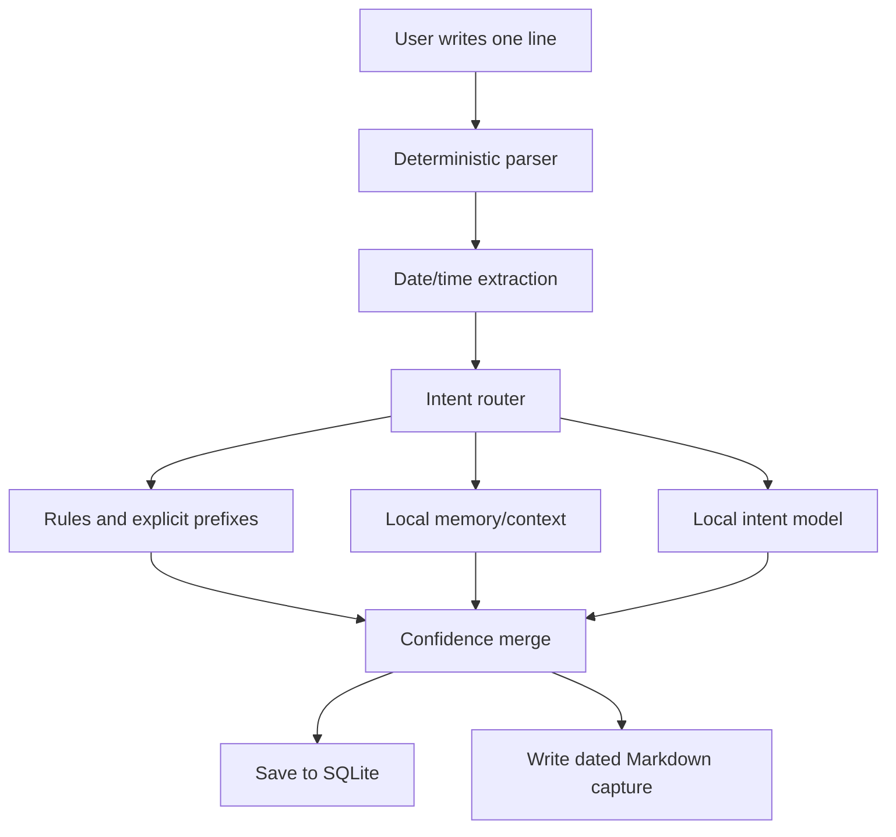

# Momentum AI Architecture And Training

Momentum uses a local intent model to understand short capture text and route it into one of three app destinations:

- `task`
- `goal`
- `note`

The current production model uses three destinations: `task`, `goal`, and `note`. The earlier `plan` class was removed because it was too ambiguous in real use; planning language is now stored as a note unless the text has a clear date, time, or action signal.

## Product Goal

The capture experience should feel like writing into a smart notebook:

```text
apply to capgemini tonight
linkedin every day
capgemini interview felt rough
job search roadmap
```

Momentum should infer where each line belongs without forcing the user to manually select a mode every time.

## Current Architecture



The app keeps simple deterministic behavior for things machines should not guess:

- dates
- times
- explicit prefixes like `task:` or `goal:`
- carry-forward flags

The learned model handles the fuzzy part:

```text
Is this line a task, goal, or note?
```

## Data Design

The main training dataset is:

```text
training_data/final/momentum_intent_20k_balanced.jsonl
```

The original dataset contained 20,000 examples:

```text
task: 5,000
goal: 5,000
note: 5,000
plan: 5,000
```

For the current app, `plan` examples are collapsed into `note`, then the final training split is rebalanced around the three production destinations.

The source buckets are:

```text
training_data/final/general_life_productivity_12k.jsonl
training_data/final/engineering_software_4k.jsonl
training_data/final/hard_ambiguous_2k.jsonl
training_data/final/personal_corrections_2k.jsonl
```

The `personal_corrections_2k.jsonl` file is intentionally kept separately. It is useful for personalization and correction learning, but the base model should first learn a clean general definition of the three labels.

## Model Versions

### Scratch Model

The scratch model is a custom small Transformer encoder trained from the Momentum dataset only.

Location:

```text
training/train_intent_model.py
training/momentum_intent_model.py
```

Result:

```text
Parameters: 2,976,964
Checkpoint size: about 12 MB
Test accuracy: 93.95%
Test macro F1: 93.97%
```

This is the ultra-light version. It is useful if we want a small local model with minimal dependencies.

### Premium Model

The best historical pretrained model used MiniLM as the encoder and fine-tuned it for Momentum labels.

Location:

```text
training/train_premium_intent_model.py
training/predict_premium_intent.py
```

Base model:

```text
microsoft/MiniLM-L12-H384-uncased
```

Result:

```text
Parameters: 33,361,540
Checkpoint size: about 133 MB
Test accuracy: 98.30%
Test macro F1: 98.30%
```

This was the best four-class production-balance model before the app moved to the simpler three-class routing design.

### ModernBERT Experiment

ModernBERT is the current accuracy winner, tested in an isolated experiment folder:

```text
experiments/modernbert/
```

Base model:

```text
answerdotai/ModernBERT-base
```

Result:

```text
Parameters: 149,607,940
Checkpoint size: about 598 MB
Validation macro F1: 98.50%
Test accuracy: 99.00%
Test macro F1: 99.00%
Personal correction macro F1: 99.85%
Hand-written realistic checks: 24 / 24 correct
```

ModernBERT gives the highest accuracy so far, but MiniLM is still the better default runtime candidate if app size and CPU startup matter.

### Distilled Scratch Student

The distilled student uses ModernBERT as a teacher and trains a smaller scratch-style model from:

```text
hard labels from momentum_intent_20k_balanced.jsonl
soft teacher probabilities from ModernBERT
personal correction examples
```

Location:

```text
experiments/distillation/
```

Result:

```text
Parameters: 6,337,284
Checkpoint size: about 25 MB
Validation macro F1: 97.10%
Test accuracy: 96.40%
Test macro F1: 96.40%
Personal correction macro F1: 99.15%
```

This is the best small model so far. It is much stronger than the original scratch model while staying far smaller than MiniLM and ModernBERT.

### Distilled Student v2

Distilled Student v2 improves the small model with:

```text
BPE tokenizer
ModernBERT teacher probabilities
MiniLM teacher probabilities
extra hard ambiguous examples
personal correction examples
early stopping
```

Location:

```text
experiments/distillation_v2/
```

Result:

```text
Parameters: 10,030,724
Checkpoint size: about 39 MB
Validation macro F1: 97.13%
Test accuracy: 97.38%
Test macro F1: 97.37%
Personal correction macro F1: 99.60%
```

This is now the best small model. It is still below MiniLM, but it is much closer while being less than one third of MiniLM's checkpoint size.

## Training Environment

Use Python 3.11 on this laptop. It has CUDA PyTorch available and detects the GPU:

```text
NVIDIA GeForce RTX 5060 Laptop GPU
```

Check CUDA:

```powershell
py -3.11 -c "import torch; print(torch.cuda.is_available()); print(torch.cuda.get_device_name(0))"
```

## Train The Best Model

Run:

```powershell
py -3.11 training/train_premium_intent_model.py --device cuda
```

The historical MiniLM script:

1. Loads `momentum_intent_20k_balanced.jsonl`.
2. Splits it into train/validation/test sets.
3. Fine-tunes MiniLM for the Momentum labels.
4. Saves the best validation checkpoint.
5. Copies the latest model to `models/momentum_intent/premium_latest/`.

Latest trained model:

```text
models/momentum_intent/premium_latest/
```

## Test The Model

Run:

```powershell
py -3.11 training/predict_premium_intent.py "apply to capgemini tonight" --device cuda
py -3.11 training/predict_premium_intent.py "linkedin every day" --device cuda
py -3.11 training/predict_premium_intent.py "capgemini interview felt rough" --device cuda
py -3.11 training/predict_premium_intent.py "job search roadmap" --device cuda
```

Expected:

```text
apply to capgemini tonight -> task
linkedin every day -> goal
capgemini interview felt rough -> note
job search roadmap -> note
```

## Why This Is Not A Full LLM

Momentum does not need a text generator for this feature. A full LLM would be larger, slower, and more expensive to run locally.

The task is intent understanding:

```text
short text -> correct app destination
```

An encoder model is a better fit because it is:

- faster
- smaller
- easier to train
- easier to evaluate
- safer for local-first behavior
- strong enough for classification and context understanding

## Personalization Strategy

The first model learns the general meaning of each label. The next layer should learn from user corrections.

Example:

```text
text: linkedin tomorrow
model predicted: note
user corrected to: task
```

Those corrections can be stored and used in three ways:

1. Immediate memory rule: if a very similar phrase appears again, prefer the corrected label.
2. Periodic fine-tune: add correction examples and retrain the model.
3. Lightweight adapter layer: train a small correction model on top of the base model.

This keeps Momentum intelligent without needing an online LLM API.

## Recommended Runtime Design

Use a layered router:

```text
1. Explicit prefix wins
2. Date/time parser extracts scheduling info
3. Local memory checks similar previous entries
4. Distilled three-class local model predicts intent
5. Rules act as fallback
6. Low confidence asks for confirmation
```

Confidence thresholds should control behavior:

```text
>= 0.85  save automatically
0.65-0.85 show suggested destination
< 0.65 ask user to choose
```

## Current Best Result

The active app checkpoint is:

```text
experiments/three_class/latest/
```

The best historical accuracy checkpoint is:

```text
experiments/modernbert/latest/
```

Latest evaluation:

```text
Three-class distilled app model test macro F1: 96.50%
ModernBERT test macro F1: 99.00%
MiniLM test macro F1: 98.30%
Distilled student v2 test macro F1: 97.37%
Distilled student v1 test macro F1: 96.40%
```

## Next Steps

1. Keep the three-class model wired into the capture router. Done in `momentum/capture/local_model.py`.
2. Keep explicit prefixes and date parsing deterministic. Done in `momentum/capture/intent.py` and `momentum/capture/router.py`.
3. Save every model mistake as a correction example. Done through recategorization, inbox review, and manual mode saves.
4. Fine-tune again after collecting real app usage. Use `training/export_real_usage_dataset.py`, then `experiments/three_class/build_real_usage_cache.py`, then `experiments/three_class/train_three_class.py`.
5. Consider exporting to ONNX for faster CPU inference if startup/runtime size becomes important. Use `experiments/three_class/export_onnx.py` when ready to benchmark ONNX Runtime.
