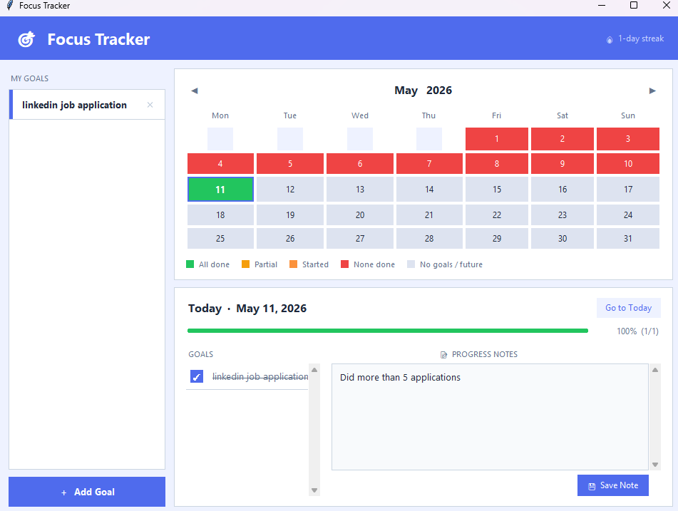

# 🎯 Focus Tracker

A lightweight daily goal tracker for Windows — no subscriptions, no accounts, no internet. Just open it, tick off your goals, and see your progress build up over the month.



---

## Features

- **Goal management** — Add goals with a title, description, and a colour of your choice. Goals appear on every day automatically.
- **Daily tick-offs** — Check each goal as you complete it. Checked goals get a strikethrough so you can see what's left at a glance.
- **Progress bar** — A colour-coded bar shows your daily completion percentage (green = 100%, amber = on track, blue = started).
- **Progress notes** — Write a short note for each day to record how things went. Notes are saved per day and persist across sessions.
- **Colour-coded calendar** — Every day in the month is shaded:
  - 🟢 Green — all goals completed
  - 🟡 Amber — 50 % or more done
  - 🟠 Orange — at least one done
  - 🔴 Red — goals existed but none ticked
  - ⬜ Grey — no goals recorded / future day
- **Streak counter** — Tracks consecutive days where you completed at least one goal.
- **Click any day** — Browse back through past days to review or update ticks and notes.

---

## Download & Run

### Option A — Standalone exe (no Python needed)

1. Download **[FocusTracker.exe](FocusTracker.exe)** from this repo.
2. Put it anywhere on your PC (e.g. `Documents\FocusTracker\`).
3. Double-click to run. A `focus_tracker_data.json` file is created next to the exe to store your data.

> **Tip:** Right-click the exe → *Send to* → *Desktop (create shortcut)* to pin it to your desktop.

### Option B — Run from source (requires Python 3.x)

```bash
git clone https://github.com/Bharathkondur/Focus_tracker.git
cd Focus_tracker
python focus_tracker.py
```

No third-party packages needed — only the Python standard library (`tkinter`, `json`, `uuid`, `calendar`).

---

## Build the exe yourself

Run **`Build_Exe.bat`** once. It installs PyInstaller, compiles a single-file exe, and drops a shortcut on your Desktop.

---

## Data & Privacy

All data is stored locally in `focus_tracker_data.json` next to the exe. Nothing is sent anywhere.

---

## Tech stack

| | |
|---|---|
| Language | Python 3 |
| UI | Tkinter (standard library) |
| Storage | JSON |
| Packaging | PyInstaller |
| Platform | Windows 10 / 11 |
