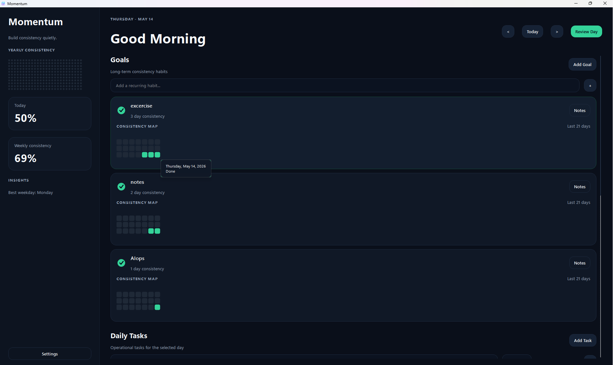
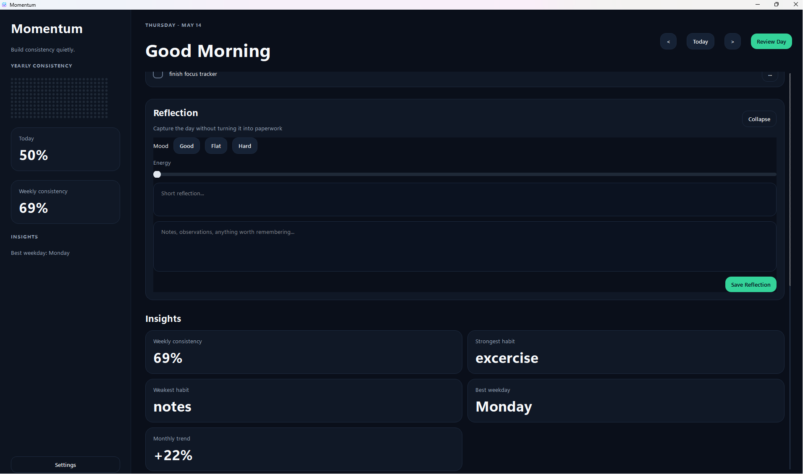

# Momentum

Momentum is a local-first Windows desktop app for capturing notes, tasks, and goals from one simple writing box.

The current direction is the Momentum Capture experience: type a sentence, press Enter, and the app routes it into the right place using deterministic rules plus a small local intent model. It is designed to feel closer to a smart notebook than a heavy project management tool.

There is no account system, cloud sync, telemetry, or runtime network dependency. App data stays on the machine in SQLite and local Markdown files.

## Screenshots





## Features

- One-line capture for notes, tasks, and goals.
- Local three-class routing: `task`, `goal`, and `note`.
- Explicit prefixes such as `task:`, `goal:`, and `note:` always win.
- Deterministic date and time parsing for scheduled tasks.
- Daily notebook with autosave, pinning, search, and tags.
- Sidebar library for previous notes, tasks, goals, projects, reports, and trash.
- Safe delete flow with restore support from Trash.
- Light and dark themes.
- Local summaries for 7 days, 1 month, 1 year, or custom date ranges.
- Recurring goals, daily tasks, reflection, insights, and consistency maps from the original Focus Tracker workflow.
- Local SQLite database stored as `momentum.sqlite3`.
- Dated Markdown capture exports under `momentum_captures/YYYY/MM-Month/DD/`.
- Real usage correction capture so routing mistakes can improve future training.

## Tech Stack

- Python
- PySide6
- SQLite
- PyTorch and `tokenizers` for optional local model inference
- Custom Qt widgets and QSS themes
- PyInstaller build scripts for local executable builds

## Project Structure

```text
momentum/
  core/       domain models, date helpers, analytics
  data/       SQLite schema, repository, paths, legacy migration
  capture/    parser, router, memory, local model wrapper, summaries
  state/      Qt signal-based application store
  ui/         main window, sidebar, views, widgets, theme

experiments/
  three_class/        production three-class model scripts
  distillation/       teacher-student experiments
  distillation_v2/    BPE distilled student experiments
  modernbert/         ModernBERT teacher experiment

training/             dataset export, training, and prediction scripts

focus_tracker.py      source launcher
FocusTracker.pyw      windowed launcher
momentum_capture.py   Momentum Capture launcher
MomentumCapture.pyw   windowed Momentum Capture launcher
Build_Exe.bat         Windows executable builder
Build_Capture_Exe.bat Momentum Capture executable builder
```

## Run From Source

```bash
python -m pip install -r requirements.txt
python momentum_capture.py
```

On Windows, the windowed launcher is:

```bash
python MomentumCapture.pyw
```

The original Focus Tracker window is still available:

```bash
python focus_tracker.py
```

## Build A Local Exe

```powershell
.\Build_Capture_Exe.bat
```

For the original Focus Tracker executable:

```powershell
.\Build_Exe.bat
```

Generated executables and build folders are local artifacts and are not required for source development.

## Capture Examples

```text
goal: exercise daily
tomorrow 09:30 finish portfolio review
note: felt focused after the morning session
roadmap for improving the job search
linkedin every day
capgemini interview felt rough
```

Momentum uses the app context to route each entry:

- a dated action becomes a task
- a recurring habit becomes a goal
- observations, reflections, ideas, and plans become notes

## Local AI Architecture

Momentum does not need a cloud LLM for routing. The production architecture is layered:

```text
1. Explicit prefix rules
2. Date and time parser
3. Local memory and correction lookup
4. Three-class local encoder model
5. Tiny fallback classifier
6. Confidence-based save or review
```

The app currently uses three destinations: `task`, `goal`, and `note`. The earlier `plan` class was removed because it overlapped too much with notes in real usage.

Training and architecture details are documented in [AI_ARCHITECTURE.md](AI_ARCHITECTURE.md).

## Training Workflow

Model checkpoints and datasets are intentionally not committed to GitHub. Keep them local.

Useful commands:

```powershell
py -3.11 training\export_real_usage_dataset.py --output training_data\real_usage\momentum_real_usage.jsonl
py -3.11 experiments\three_class\build_real_usage_cache.py --usage training_data\real_usage\momentum_real_usage.jsonl --output experiments\three_class\cache\three_class_with_real_usage.jsonl
py -3.11 experiments\three_class\train_three_class.py --cache experiments\three_class\cache\three_class_with_real_usage.jsonl --device cuda
```

Optional ONNX export:

```powershell
py -3.11 experiments\three_class\export_onnx.py --checkpoint-dir experiments\three_class\latest --output experiments\three_class\latest\model.onnx --opset 18
```

## Backup, Export, And Support

Open the Reports tab in Momentum Capture to run local support actions:

- Create Backup
- Export Database
- Support Bundle
- Open Data Folder

These write to ignored local folders: `backups/`, `exports/`, and `logs/`.

## Package For Windows

Create a local release zip with the executable, install/uninstall scripts, docs, and SHA-256 checksum:

```powershell
.\scripts\package_windows_release.ps1
```

To package the existing `MomentumCapture.exe` without rebuilding:

```powershell
.\scripts\package_windows_release.ps1 -SkipBuild
```

## Data And Privacy

Momentum stores app data locally. These files are ignored by Git:

- `momentum.sqlite3*`
- `daily_focus.json`
- `focus_tracker_data.json`
- `momentum_captures/`
- `models/`
- `training_data/`
- model exports such as `*.pt`, `*.onnx`, `*.safetensors`, and `*.bin`
- `build/`
- `dist/`
- `__pycache__/`

If `daily_focus.json` exists and `momentum.sqlite3` has no goals yet, Momentum imports the legacy daily goals, checks, tasks, task checks, notes, and mood values on first run.

## Development Notes

Use `requirements.txt` for runtime dependencies.

- Momentum Capture entry point: `momentum.capture_main:main`
- Original Focus Tracker entry point: `momentum.main:main`
- Training documentation: `training/README.md`
- AI architecture notes: `AI_ARCHITECTURE.md`
- Release-readiness gaps and next steps: `RELEASE_READINESS.md`

Run the current test suite with:

```powershell
python -m unittest discover -s tests -v
```

Install the local Git hook at `.git/hooks/post-commit` that pushes after every successful commit:

```powershell
.\scripts\install_git_hooks.ps1
```

To skip auto-push for one commit:

```powershell
$env:MOMENTUM_AUTO_PUSH = "0"
git commit -m "local work in progress"
Remove-Item Env:\MOMENTUM_AUTO_PUSH
```
